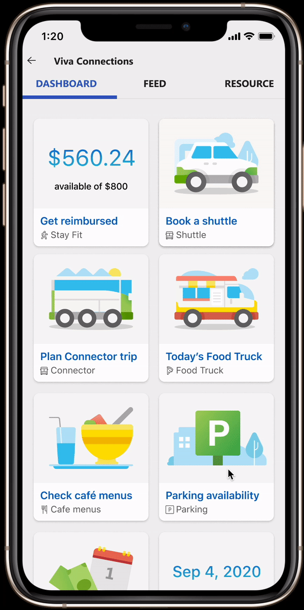

# global-vehicle-registration

## About

Global Smart Parking Vehicle Registration Solutions - an unassumingly simple idea that acts as a single & configurable solution/product.

## Prototype

Our sharepoint extension in action -

## Used SharePoint Framework Version

## Applies to

- [SharePoint Framework](https://aka.ms/spfx)

## Solution

| Solution                    | Author(s) |
| --------------------------- | --------- |
| global-vehicle-registration | Microsoft |

## Minimal Path to Awesome

- Clone this repository
- Ensure that you are at the solution folder
- in the command-line run:
  - **npm install**
  - **gulp serve**

## Features

This extension illustrates the following concepts:

- Reducing Carbon Footprint using global VR solution
- Support Stack Parking in global solution
- Show parking trends & direction to employees/users
- Registration through license plate capture to reduce time, carbon footprint, and increase security

## References

- [Hackathon Project](https://hackbox.microsoft.com/project/5898)
- [Figma for design](https://www.figma.com/proto/fT3J9TUXZtGo73vQCY441P/Global-Vehicle-Registration?node-id=4%3A1174&starting-point-node-id=1%3A192)
